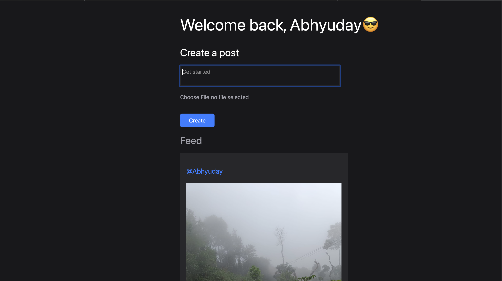
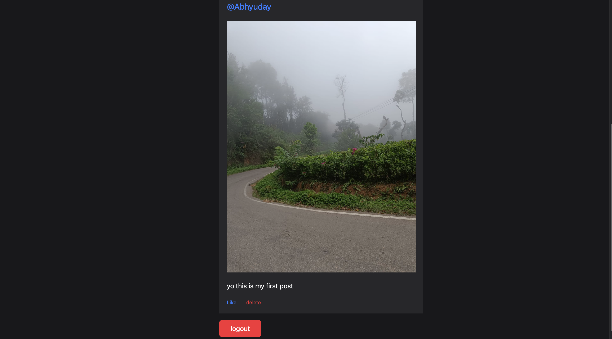

# 🌊 WAVY 
A simple social media that connects users and lets them interact with the  posts 

## 📸 Visuals 

## 📦 Features

- User login and authentication 
- Profile setion
- Posts text and pictures 
- Like and delete 

## 🛠️ Tech 

**Frontend:** Tailwind css
**Backend:** Node.js / Express / MongoDB  
**Other:** JWT / Cookie-parser / Multer 

